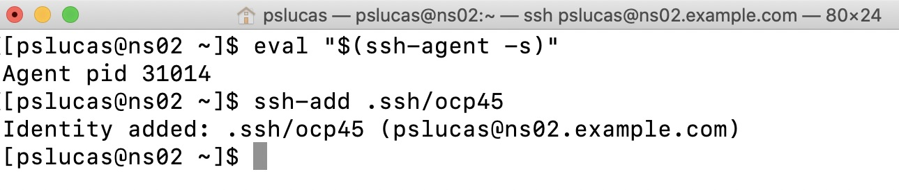

# OpenShift 4.5 vSphere Installer Provisioned Infrastructure Example
The release of OpenShift 4.5 added a new vSphere IPI installation option that makes it very easy to quickly spin up an OCP cluster in an EXSi environment.  The "straight" out of the box installation creates three masters and three worker nodes with minimal effort.  IPI installation supports additional customizations, but in this example I will not use any of the customization capabilities.

The lab I'm using for this installation is made up of three x86 8-core 64GB RAM machines formally used for gaming.  EXSI environment is a bare bones VMWare vSphere Essentials 6.7 setup.  I'm also using a two bay Synology NAS for shared storage across the vSphere cluster.  Finally I ran the installation from a RHEL 8 server instance that was hosting by DNS and DHCP services.  All the following instructions are completed this RHEL 8 server running in my vSphere cluster.

OCP 4.5 installation documentation can be found here -> https://docs.openshift.com/container-platform/4.5/welcome/index.html

## Installation Steps

###Installation Pre-reqs:
For this OCP 4.5 IPI vSphere installation, you need DNS and DHCP available to the cluster.
- DNS service - For the installation you need to define two static IP address.  One for the cluster api access - api.ocp4.example.com and one for cluster ingress access *.apps.ocp4.example.com. For my lab I use example.com as the domain.
  - Forward zone settings
    - api.ocp4	IN	A	10.1.10.181
    - *.apps.ocp4	IN	A	10.1.10.182
  - Reverse zone settings
    - api.ocp4	A	10.1.10.181
    - *.apps.ocp4	A	10.1.10.182
    - 181	IN	PTR	api.ocp4.example.com.
- DHCP service

### Optional - Create an ssh key for password-less ssh to the ssh to master node for debugging, etc.
1. Create ssh key 
  - ssh-keygen -t rsa -b 4096 -N '' -f ~/.ssh/ocp45
  
  
2. Start up ssh-agent and add the new key to the ssh-agent.  This key will be added during the installation.
  - eval "$(ssh-agent -s)"
  - ssh-add .ssh/ocp45
  
  
 
 ### Get installation software
 1. Go to the Infrastructure Provider page on the Red Hat OpenShift Cluster Manager site and login -> https://cloud.redhat.com/openshift/install
 2. After you logon, chose the vSphere tile
 
 
 3. From the download page click the Download Installer button, click the Download Pull Secret button and click the Download command-line tools button.  Note that further down this page there is a button to download Red Hat Enterprise Linux CoreOS (RHCOS).  We will let the installation program grab that file for us.
 
 
 
 4. I made a separate directory to run the installation for the OCP cluster and moved the openshift-install-linux.tar.gz and pull-secret files there.  In your "install" directory untar the openshift-install-linux.tar.gz
  - tar xvf openshift-install-linux.tar.gz
  
  5. We need your vCenter’s trusted root CA certificates to allow the OCP installation program to access your vCenter via it's API.  To download the vCenter cerfiticate go to Fyour vCenter homepage, click Download trusted root CA certificates link (see right hand side of the homepage).
  
  
  
  6. Unzip the download.zip that contains the certs.  In the resutling certs folder you'll see subfolders for linux, mac and windows.  You can use the "tree certs" command to see the files and file structure.
  
  
  
  7. Run the following commads to update your stystems...
  - sudo cp certs/lin/* /etc/pki/ca-trust/source/anchors
  - sudo update-ca-trust extract
  
  
  
  8. We are now ready to deploy the cluster.  Change to iinstallation directory.  In the installation directory create a directory to store the installation artifacts (configuration, authentication information, log files, etc.)  I called my installtion artifacts directory ocp45.  Run the following installation command.
  - ./openshift-install create cluster --dir=ocp45 --log-level=info
  
  The install command will step you through a set of questions regarding the installation.  Some answers may be pre-populted for you and you can use the up/down arrow key to chose the appropriate response.
  
    Here is the list of questions the installer will ask you:
      1. SSH Public Key
      2. Platform - chose vSphere
      3. vCenter - provide the url to your vCenter - vsca01.exanple.com
        - You may be also prompted for a vSphere datacenter and vSphere cluster if have more than one option available to you.
      4. Username - the username for your vCenter - administator@vsphere.local
      5. Password - the password for your vCenter user - *******
      6. Default Datastore - chose the vSphere datastore where the VMs will be stored
        - You may also be prompted for a vSphere network if you have more than one option available to you
      7. Virtual IP address for API - this is the API IP address we perviously add to our DNS service - 10.1.10.181
      8. Viftual IP address for Ingress - this is the ingress IP address we perviously add to our DNS service - 10.1.10.182
      9. Base Domain - example.com
      10. Cluster Name - ocp4
      11. Pull Secret - Copy and past the pull secret you downloaded in step 3.
      12. Hit the enter key to start the install
     
   
    
  9. Now you wait for the install to complete.  You'll see a series of messages like those below as the install progresses and if watch the vCenter admin screen you'll see images created, rebooted, etc. as the cluster is configured and started.
  
    INFO Obtaining RHCOS image file from 'https://releases-art-rhcos.svc.ci.openshift.org/art/storage/releases/rhcos-4.5/45.82.202007141718-0/x86_64/rhcos-       45.82.202007141718-0-vmware.x86_64.ova?sha256=9c977abeba0aeedc222ae9dd3d27e659bb5c959c9fd6b199f940d16de07ded4e' 
    INFO The file was found in cache: /home/pslucas/.cache/openshift-installer/image_cache/187f73af432c837eaa23361023b1656c. Reusing... INFO Creating infrastructure resources...         *
    INFO Waiting up to 20m0s for the Kubernetes API at https://api.ocp4.example.com:6443... 
    INFO API v1.18.3+3107688 up                     
    INFO Waiting up to 40m0s for bootstrapping to 
    INFO Waiting up to 30m0s for the cluster at https://api.ocp4.example.com:6443 to initialize... *
    W0723 17:47:56.542835   31492 reflector.go:326] k8s.io/client-go/tools/watch/informerwatcher.go:146: watch of *v1.ClusterVersion ended with: very short watch: k8s.io/client-go/tools/watch/informerwatcher.go:146: Unexpected watch close - watch lasted less than a second and no items received
    INFO Waiting up to 10m0s for the openshift-console route to be created...
    INFO Install complete!                           
    INFO To access the cluster as the system:admin user when using 'oc', run 'export KUBECONFIG=/home/pslucas/ocp45install/ocp45/auth/kubeconfig' 
    INFO Access the OpenShift web-console here: https://console-openshift-console.apps.ocp4.example.com
    INFO Login to the console with user: "kubeadmin", and password: “K**************************98” 
    INFO Time elapsed: 37m47s      

